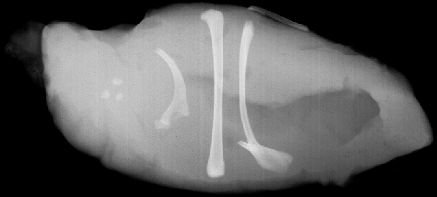

# Image-Segmentation

We have an X-Ray image where we try to segment on the inner bones of the image. This is done by setting all the pixel values less than a threshold to 0, and setting the rest to 255. This highlights the bones in the image.

## Steps:
1.  Plotting a Histogram of the image to find the values of the pixels in the image.

    
  
  <figcaption>
Image
</figcaption>

2.  We find the high density pixel values in the histogram and fix our threshold.

3.  After applying the threshold and assigning the values, we get the following image

    
  
  <figcaption>
Image
</figcaption>

4. We then place the bounding boxes for these segments

    
  
  <figcaption>
Image
</figcaption>

